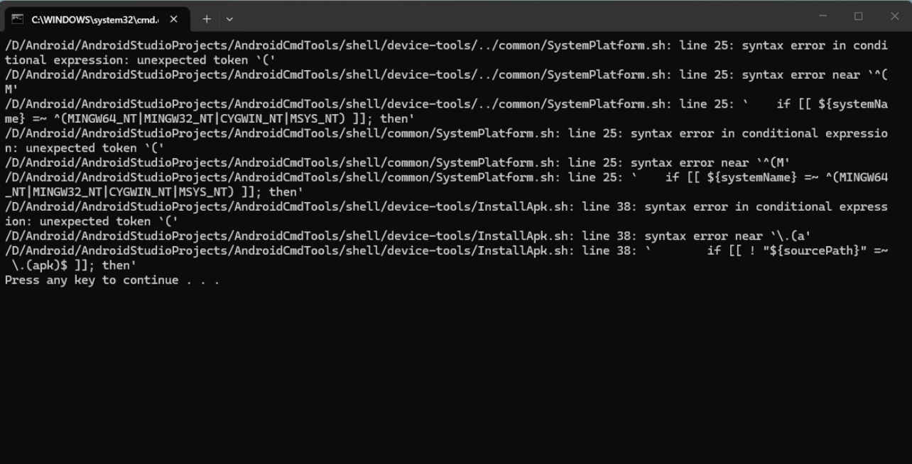

#### 目录

* [文件 xxx.command 无法执行因为您没有正确的访问权限](#文件-xxxcommand-无法执行因为您没有正确的访问权限)

* [在 Windows 运行 bat 脚本出现终端出现一大堆代码报错怎么处理呢](#在-windows-运行-bat-脚本出现终端出现一大堆代码报错怎么处理呢)

#### 文件 xxx.command 无法执行因为您没有正确的访问权限

* 这个问题是 macOs 或 Linux 运行脚本时没有添加执行权限导致的，为脚本添加执行权限即可，具体步骤如下：

    * 进入项目根目录（xxx 请替换成项目所在路径）

    ```bash
    cd xxx/AndroidCmdTools
    ```

    * 递归为所有脚本文件添加执行权限

    ```bash
    find . -type f -exec chmod +x {} \;
    ```

#### 在 Windows 运行 bat 脚本出现终端出现一大堆代码报错怎么处理呢



* 出现这个问题，大概率是你的电脑配置了 `Bash` 环境，但是这个 `Bash` 环境有问题导致的，需要先对问题进行排查：

* 第一步：先排查当前 Windows 版本是否和 `Git Bash` 有冲突，在桌面右击空白处，选择 `Git Bash Here`，打开 `Git Bash` 终端，执行命令 `bash --version`

    * 如果鼠标右键不能找到 `Git Bash Here` 选项，则请找到 Git 安装目录，例如 `C:\Program Files\Git\bin`，找到 `bash.exe` 的程序，然后点击运行即可

    * 如果是无法打开 `Git Bash` 终端的情况，则证明当前的 `Git Bash` 版本和当前 Windows 存在冲突，解决方案如下：

        * 去系统环境变量配置中，移除刚刚给 Git Bash 配置的环境变量，即前面配置的 `C:\Program Files\Git\bin`，移除该环境变量不会影响使用 Git 命令

        * 请下载并解压 [WindowsBash](https://github.com/getActivity/AndroidCmdTools/releases/download/1.0/WindowsBash.zip)，推荐解压到 `C:\Program Files\WindowsBash` 这个目录下

        * 在系统环境变量 Path 中，添加 WindowsBash 所在的路径，例如 `C:\Program Files\WindowsBash\bin`，然后保存修改

        * 关闭已打开的所有命令行窗口，然后同时按下 `Windows 键 + R 键`，输入 `Cmd` 打开 `命令行提示符` 窗口，执行命令 `bash --version`

            * 如果输出版本信息，则表示配置成功

            * 如果没有输出任何信息，则表示配置有问题，请通过提 [issue](https://github.com/getActivity/AndroidCmdTools/issues) 来提交你的问题

    * 如果运行 `bash --version` 能输出版本信息，则表示 `Git Bash` 是正常安装的，可以进入下一步排查

* 第二步：再排查 Windows 系统是否存在不同版本的 `Bash` 环境，分别在 `Git Bash`、`Cmd` 这几个终端窗口分别运行 `bash --version` 命令

    * 如果运行 `bash --version` 能输出的结果不一样，则证明电脑存在多个 `Bash` 环境，则应该应该删除多余的 Bash 环境，仅保留 `Git Bash` 环境即可

        * 在 `Cmd` 终端运行 `where bash` 命令，这个命令会输出当前系统环境变量中所有 `bash.exe` 的完整路径，请自行到系统环境变量中进行剔除

    * 如果运行 `bash --version` 能输出的结果一样，则证明 `Bash` 环境配置没有问题，如果到这一步你还是无法定位到问题，请通过提 [issue](https://github.com/getActivity/AndroidCmdTools/issues) 来提交你的问题

